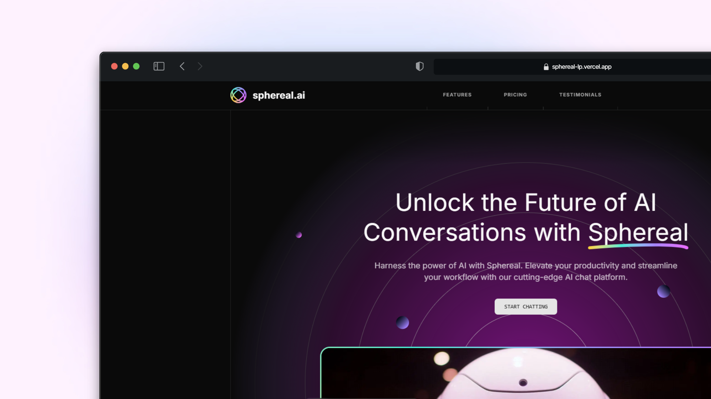

# Futuristic AI SaaS Landing Page

Design Inspiration : https://ui8.net/ui8/products/brainwave-ai-landing-page-kit

### 🪛 Technologies used

- Next.js 15
- TailwindCSS v4
- Typescript
- Shadcn/ui
- Motion (originally known as framer-motion)

### ☑️ How to run this project?
To run this project on your local environment, follow the following steps. If you don't have `pnpm` installed, install it with the following command : `npm i -g pnpm`

- Clone the repository to your local machine or download the source code.
- Run the command `pnpm install` in the project directory to install the required dependencies
- Run the command `pnpm build` then `pnpm start` to start the production build and the production server of the project.
- Open your internet browser and go to the following address: http://localhost:3000